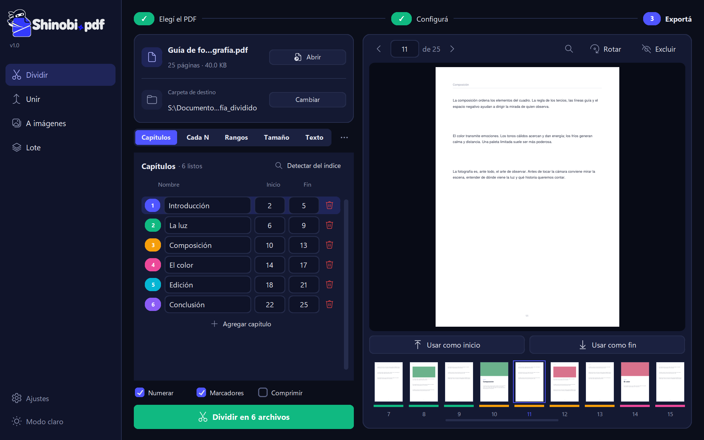

  <picture>
    <source media="(prefers-color-scheme: dark)" srcset="shinobi/assets/logo_dark.png">
    
  </picture>

  <b>Dividí, uní y convertí tus PDFs sin subirlos a ningún lado.</b> 
  Una app de escritorio para Windows rápida, gratis y de código abierto. Tus archivos nunca salen de tu computadora.

  
  
  
  

  <a href="https://shinobipdf.com"><b>Sitio web</b></a> ·
  <a href="https://github.com/MarraTX/ShinobiPDF/releases/latest"><b>Descargar</b></a> ·
  <a href="README.md"><b>English</b></a>

  

## Funciones

*   **Cinco formas de dividir:** por capítulos, cada N páginas, por rangos, por tamaño máximo de archivo o por texto (un archivo por factura, por ejemplo).
*   **Detección automática de capítulos** desde los marcadores del PDF, con miniaturas de colores.
*   **Unir PDFs** en el orden que elijas, **exportar páginas a imágenes** y **procesar en lote** muchos archivos a la vez.
*   **Buscar texto en el PDF**, rotar y excluir páginas antes de exportar.
*   **100% sin conexión y privado:** sin cuentas, sin anuncios, sin subir nada.
*   En español e inglés, modo claro y oscuro, y clic derecho en el Explorador de Windows.

## Descarga

Bajá **`ShinobiPDF-Setup.exe`** (instalador) o **`ShinobiPDF-Portable.zip`** (sin instalación) desde la
[última versión](https://github.com/MarraTX/ShinobiPDF/releases/latest), o desde [shinobipdf.com](https://shinobipdf.com).
El instalador no pide permisos de administrador.

## Contribuir

Los reportes de errores y las ideas son bienvenidos: [abrí un issue](https://github.com/MarraTX/ShinobiPDF/issues/new)
o usá *Ajustes → Reportar un problema* dentro de la app.
Si Shinobi.pdf te resulta útil, podés [apoyar el proyecto](https://shinobipdf.com/#donate).

## Política de firma de código

Firma de código gratuita provista por [SignPath.io](https://about.signpath.io), con certificado de [SignPath Foundation](https://signpath.org).

*   Commits y revisión: [MarraTX](https://github.com/MarraTX)
*   Aprobación de firmas: [MarraTX](https://github.com/MarraTX)

Cada versión firmada se compila con GitHub Actions a partir del código de este repositorio, y cada pedido de firma se aprueba a mano.

## Privacidad

El programa no envía información a otros sistemas salvo que lo pida quien lo usa o lo instala, con una única excepción:

*   **Búsqueda de actualizaciones:** como mucho una vez por día, la app le pregunta a la API de GitHub
    (`api.github.com`) cuál es la última versión publicada. El pedido solo incluye el nombre y la versión
    de la app; no se envían archivos, nombres de archivos ni datos personales. Se puede desactivar en *Ajustes*.

*Reportar un problema* abre un issue de GitHub ya completado en el navegador solo cuando la persona lo elige,
y puede revisar su contenido antes de enviarlo.

## Licencia

Shinobi.pdf se publica bajo la licencia [AGPL-3.0](LICENSE), la misma de [PyMuPDF](https://pymupdf.readthedocs.io/), que usa la app.
