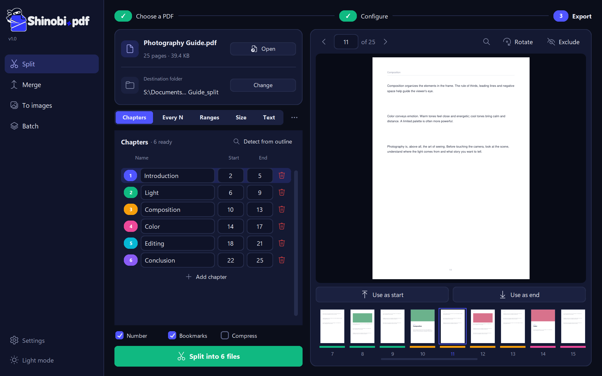

  <picture>
    <source media="(prefers-color-scheme: dark)" srcset="shinobi/assets/logo_dark.png">
    
  </picture>

  <b>Split, merge and convert your PDFs without uploading them anywhere.</b> 
  A fast, free and open-source desktop app for Windows. Your files never leave your computer.

  
  
  
  

  <a href="https://shinobipdf.com/en/"><b>Website</b></a> ·
  <a href="https://github.com/MarraTX/ShinobiPDF/releases/latest"><b>Download</b></a> ·
  <a href="README.es.md"><b>Español</b></a>

  

## Features

*   **Split PDFs five ways:** by chapters, every N pages, by page ranges, by maximum file size or by text (one file per invoice, for example).
*   **Automatic chapter detection** from the PDF bookmarks, with color-coded thumbnails.
*   **Merge PDFs** in any order, **export pages to images** and **batch-process** many files at once.
*   **Search inside the PDF**, rotate and exclude pages before exporting.
*   **100% offline and private:** no accounts, no ads, no uploads.
*   English and Spanish, light and dark mode, right-click integration in File Explorer.

## Download

Get **`ShinobiPDF-Setup.exe`** (installer) or **`ShinobiPDF-Portable.zip`** (no installation) from the
[latest release](https://github.com/MarraTX/ShinobiPDF/releases/latest), or from [shinobipdf.com](https://shinobipdf.com/en/).
The installer doesn’t require administrator rights.

## Contributing

Bug reports and ideas are welcome: [open an issue](https://github.com/MarraTX/ShinobiPDF/issues/new),
or use *Settings → Report a problem* inside the app.
If you enjoy Shinobi.pdf, you can [support the project](https://shinobipdf.com/en/#donate).

## Code signing policy

Free code signing provided by [SignPath.io](https://about.signpath.io), certificate by [SignPath Foundation](https://signpath.org).

*   Committers and reviewers: [MarraTX](https://github.com/MarraTX)
*   Approvers: [MarraTX](https://github.com/MarraTX)

Every signed release is built by GitHub Actions from the source code in this repository, and each signing request is manually approved.

## Privacy policy

This program will not transfer any information to other networked systems unless specifically requested
by the user or the person installing or operating it, with this single exception:

*   **Update check:** at most once a day, the app asks the GitHub API (`api.github.com`) for the latest
    published version. The request only contains the app name and version; no files, file names or
    personal data are sent. It can be turned off in *Settings*.

*Report a problem* opens a pre-filled GitHub issue in the browser only when the user chooses to, and its
content can be reviewed before submitting.

## License

Shinobi.pdf is licensed under the [AGPL-3.0](LICENSE), the same license as [PyMuPDF](https://pymupdf.readthedocs.io/), which it uses.
